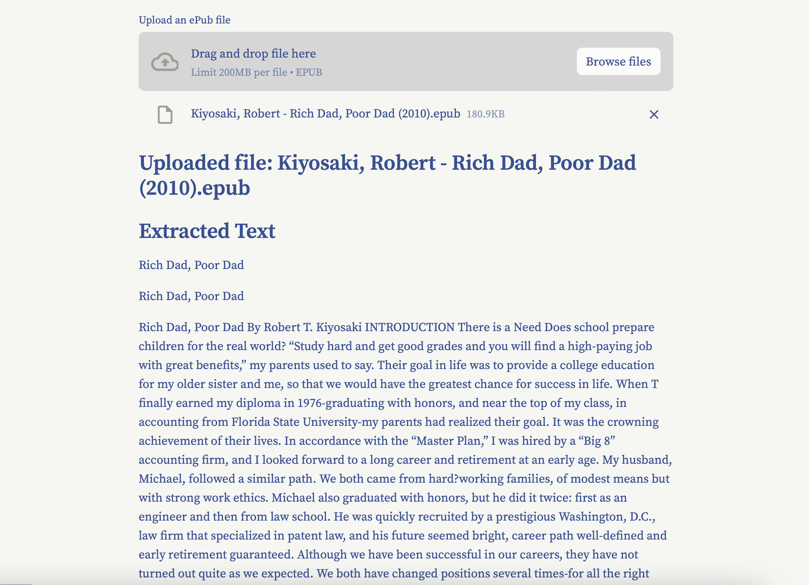

# Text Extraction from an Epub file
This code implements text parsing from an Electronic Publishing format. This implementation is written in [Pure Python](https://github.com/BrianLesko/epub_to_text/blob/main/app.py) - created for Learning Purposes.


&nbsp;

<div align="center"></div>

&nbsp;

## Dependencies

This code uses the following libraries:
- `streamlit`: for building the user interface.
- `os`: for interacting with the OS, used for file and directory operations.
- `io`: for handling the stream operations of files.
- `zipfile`: for reading and writing ZIP archive files.
- `bs4 (BeautifulSoup)`: for parsing HTML documents, used for extracting text.

&nbsp;

## Usage

Run the following commands:
```
pip install --upgrade streamlit zipfile bs4
streamlit run https://raw.githubusercontent.com/BrianLesko/epub_to_text/main/app.py?token=GHSAT0AAAAAACEZSXSIC7IMS2W5EVZKLS7SZLCFV4Q
```

This will start the local Streamlit server, and you can access the chatbot by opening a web browser and navigating to `http://localhost:8501`.

&nbsp;

## How it Works

The app as follows:
1. The user enters some text in the input field.
2. OpenAI is used to embed the text into a vector of numbers.
3. Scikit-learn is used to compare the embedding to an embedding created from a description of soccer and a description of math.
4. The app displays the similarity on a Plotly chart.
5. The user can enter more text to see more similarities.

&nbsp;

## Repository Structure
```
repository/
├── app.py # the code and UI integrated together live here
├── customize_gui # class for adding gui elements
├── requirements.txt # the python packages needed to run locally
├── .gitignore # includes the local virtual environment named my_env
├── .streamlit/
│   └── config.toml # theme info for the UI
└── docs/
    └── preview.png # preview photo for Github
```

&nbsp;

## Topics 
```
Python | Streamlit | Git | Low Code UI
text scraping | HTML parser | textual data | books
Self taught coding | Mechanical engineer | Robotics engineer
```
&nbsp;

<hr>

&nbsp;

<div align="center">


╭━━╮╭━━━┳━━┳━━━┳━╮╱╭╮        ╭╮╱╱╭━━━┳━━━┳╮╭━┳━━━╮
┃╭╮┃┃╭━╮┣┫┣┫╭━╮┃┃╰╮┃┃        ┃┃╱╱┃╭━━┫╭━╮┃┃┃╭┫╭━╮┃
┃╰╯╰┫╰━╯┃┃┃┃┃╱┃┃╭╮╰╯┃        ┃┃╱╱┃╰━━┫╰━━┫╰╯╯┃┃╱┃┃
┃╭━╮┃╭╮╭╯┃┃┃╰━╯┃┃╰╮┃┃        ┃┃╱╭┫╭━━┻━━╮┃╭╮┃┃┃╱┃┃
┃╰━╯┃┃┃╰┳┫┣┫╭━╮┃┃╱┃┃┃        ┃╰━╯┃╰━━┫╰━╯┃┃┃╰┫╰━╯┃
╰━━━┻╯╰━┻━━┻╯╱╰┻╯╱╰━╯        ╰━━━┻━━━┻━━━┻╯╰━┻━━━╯
  


&nbsp;


<a href="https://twitter.com/BrianJosephLeko"></a> &nbsp; &nbsp; &nbsp; &nbsp; &nbsp; &nbsp; <a href="https://github.com/BrianLesko"></a> &nbsp; &nbsp; &nbsp; &nbsp; &nbsp; &nbsp; <a href="https://www.linkedin.com/in/brianlesko/"></a>

follow all of these or i will kick you

</div>


&nbsp;


